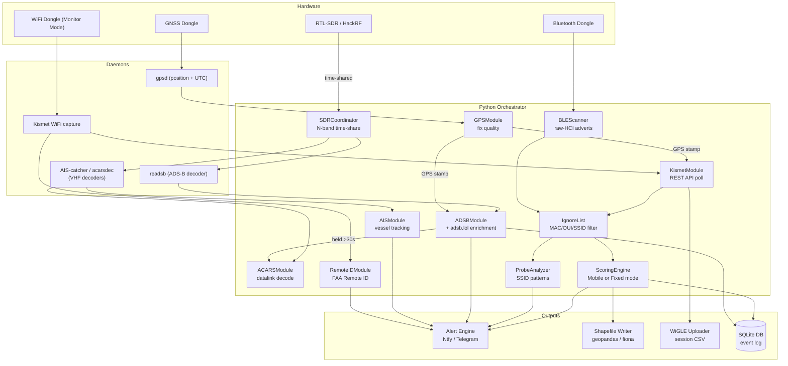

# Passive Vigilance

[](https://github.com/Isthistak3n/Passive-Vigilance/actions/workflows/ci.yml)
[](https://github.com/Isthistak3n/Passive-Vigilance/actions)
[](LICENSE)
[](https://github.com/Isthistak3n/Passive-Vigilance/releases)
[](https://www.raspberrypi.org/)

> A passive RF/WiFi/BT/ADS-B sensor platform for counter-surveillance,
> situational awareness, and open-source RF intelligence.

---

## What is this?

Passive Vigilance is a field-deployable sensor platform built on a Raspberry Pi
that helps you understand the RF environment around you — without ever
transmitting a single packet. It listens. It logs. It alerts.

Originally inspired by [Chasing Your Tail NG](https://github.com/ArgeliusLabs/Chasing-Your-Tail-NG),
Passive Vigilance extends the counter-surveillance concept into a unified,
always-on sensor platform covering WiFi, Bluetooth, ADS-B aircraft (with ACARS
datalink decode), and AIS marine traffic — all GPS-stamped and GIS-ready.

If you've ever wanted to know whether you're being followed, who's flying above
your location and where they came from, or what's transiting nearby on the water
— this is built for that.

**It is entirely passive. It never connects to, transmits to, or interferes
with any device or network.**

---

## Use cases

- **Counter-surveillance (mobile)** — detect devices that follow you across
  multiple locations using WiFi and Bluetooth beacon persistence scoring
- **Counter-surveillance (fixed / leave-behind)** — deploy as a stationary
  sensor that learns the location's normal RF "pattern of life," then flags
  devices that deviate from it — new devices that appear and linger (see
  [Detection modes](#detection-modes))
- **Reconnaissance pair (fixed + mobile team)** — a fixed base node tasks a
  roaming mobile node to find where a flagged device *beds down*: on a patrol the
  mobile node maps the local access points it hears, then matches a target's home
  network to a location and reports the finding back. A target whose home network
  is never found locally is flagged as a WiGLE lookup candidate. Optional
  (`SURVEY_ENABLED`, default off)
- **Aircraft awareness** — track aircraft overhead with full registration,
  operator, and origin data via ADS-B and adsb.lol enrichment; an aircraft held
  in view triggers an **ACARS** datalink decode window, correlated back to the
  contact by tail/flight-id
- **Maritime awareness (AIS)** — passively track nearby vessels (optional; needs
  a VHF antenna)
- **Wardriving** — automatically upload session data to WiGLE.net to
  contribute to the global RF database
- **GIS analysis** — all detections are GPS-stamped and exported as
  shapefiles, GeoJSON, and KML for post-session analysis in QGIS, ArcGIS,
  Google Earth, or Google Maps
- **Field security** — deploy as a standalone sensor at events, locations,
  or during travel for passive RF situational awareness

---

## How it works

Every detection from every sensor is tagged with a GPS fix (lat, lon, UTC)
before being written to disk or triggering an alert. The platform runs
entirely as background systemd services — plug in power and it starts
capturing automatically.



---

## Detection modes

Counter-surveillance means different things depending on whether the sensor is
**moving** or **stationary**, so the scoring strategy forks on a required
`NODE_MODE` setting. There is **no default** — the node refuses to start scoring
under an assumed mode (set `NODE_MODE` in `.env`, or pass `--mode fixed|mobile`).

| Mode | Question it answers | The signal |
|------|---------------------|------------|
| `mobile` | *"Does this device follow me across locations?"* | A device seen at many of the places you go (location diversity). The original wardriving / on-person model — unchanged. |
| `fixed` | *"What deviates from this location's normal?"* | A device that was **not** part of the learned baseline and now appears and lingers (novelty). The base-station / leave-behind model. |

A fixed node run under mobile scoring never alerts — a stationary sensor only
ever produces one location cluster, so every device forfeits the location signal.
That is exactly why mode is an explicit, fail-loud deployment choice.

**Fixed mode — pattern of life:**

- On first start the node enters a **baseline learning window**
  (`FIXED_BASELINE_HOURS`, default 72h), characterising the environment's normal
  RF devices before it begins flagging.
- After the window freezes, deviations from the baseline are flagged with
  **graduated severity** (suspicious → likely → high): **novelty** (a device
  never seen during baseline that appears and lingers) and **off-schedule** (a
  known baseline device seen in an hour-of-day it was never seen in during
  baseline). Off-schedule only activates once a device's baseline spans enough
  distinct hours to define a schedule (`OFF_SCHEDULE_MIN_BASELINE_HOURS`,
  default 12), which avoids false alarms from thin baselines.
- Devices are keyed by MAC (stable) or by a **content fingerprint** that survives
  MAC rotation (randomized devices), so one logical device's rotating addresses map
  to a single profile: WiFi clients by their probed SSIDs + information-element hash
  (`wifi-fp:`), BLE advertisers by their vendor / service / name advertisement
  (`ble-fp:`). A device with no distinctive content (bare vendor id, no named SSID)
  stays per-address so distinct devices are never merged. BLE advertisements are
  captured passively over raw HCI (`BLE_SCANNER_ENABLED`), which also recovers a
  real RSSI; randomized BLE devices were previously untrackable.
- The baseline persists to **SQLite** and survives restarts and reboots — a
  crash loop resumes the existing learning window instead of resetting it, so the
  node still eventually alerts. The learning start time is durable and never
  recomputed on boot. Per-device RSSI statistics are also banked during learning
  for future approaching-signal work.

**Contact identity, returns, and people:** a device's contact is kept stable across
address rotation at two confidence tiers (a rare, distinctive probed network is a
*strong* anchor; a less-rare one is a *medium*, "likely-same" anchor), and the
dashboard collapses a device's rotating addresses into one contact row. A contact
re-seen after leaving is flagged a **return**; one seen on a **prior session or day**
is a **returning entity** ("seen before"), remembered durably across restarts. A
person's mobile radios that travel together (a phone that is both a Wi-Fi client and
a Bluetooth device, or a phone + a wearable) are conservatively linked into one
**person** — access points are excluded, and a device only joins on strong, sustained
co-presence. Finally, the local access points act as the **environment**: a mobile
device tied to a local network or already in the baseline is a **resident**, while a
brand-new device with no local tie that lingers is flagged a **visitor of interest**.
These identity signals are display/awareness only — they never change what alerts.

**Entity / observation foundation:** independently of scoring, every poll is
recorded into a durable SQLite store (what each device probes for, a per-device
fingerprint, one entity per device, a growing observation history, plus the durable
cross-session contact registry and person links above). This runs at the capture
layer for **both** node modes and is the substrate for cross-session device
identity. It uses real upserts, so a stable device set produces a fixed number of
rows rather than growing per poll.

**Switching modes from the dashboard:** when the optional web GUI is enabled with
a `GUI_TOKEN` set, the dashboard header has a small **Mode** control to write
`NODE_MODE` to `.env`. Mode is read once at startup, so the control makes the
**restart requirement explicit** — the running node keeps its current mode until
it is restarted.

> Roadmap: still ahead are the approaching-signal (rising-RSSI) trigger,
> abnormal-dwell detection, egregious-during-baseline alerting, slow baseline
> adaptation, and WiGLE resident-vs-visitor enrichment. See
> [docs/design-and-roadmap.md](docs/design-and-roadmap.md) for the full
> phased plan and what has shipped so far.

---

## Project status

The platform is feature-complete against its mission and runs untended in the
field. In short, what works today:

- **Capture** — WiFi and Bluetooth via Kismet, passive BLE advertisements over
  raw HCI (with real signal strength), ADS-B aircraft via readsb, and — with a
  VHF antenna — AIS marine traffic and ACARS aviation datalink. A single RTL-SDR
  is time-shared across the radio bands automatically.
- **Detection** — both a **mobile** (does this device follow me?) and a **fixed**
  (what deviates from this location's normal?) scoring mode, with a durable,
  crash-safe learned baseline and identity that survives MAC randomization.
- **Awareness** — FAA Remote ID drone decode, aircraft-of-interest enrichment,
  and a contact-identity layer that collapses a device's rotating addresses,
  flags returns, and links a person's radios together.
- **Output** — a live optional web dashboard, GPS-stamped GIS exports
  (shapefile, GeoJSON, KML), and WiGLE upload.
- **Teamwork** — an optional fixed-plus-mobile reconnaissance pair.

The suite carries **850+ automated tests** and runs in CI on every change. For
the phase-by-phase breakdown of what has shipped and what is still ahead, see
[docs/design-and-roadmap.md](docs/design-and-roadmap.md).

---

## Hardware

| Component | Recommended | Notes |
|-----------|-------------|-------|
| Raspberry Pi | Pi 4B (4 GB RAM) | Pi 3B+ works for dev/test |
| SDR receiver | RTL-SDR Blog V3 or HackRF | ADS-B (1090 MHz); optional AIS/ACARS with a VHF antenna |
| WiFi dongle | Panda PAU0B, Alfa AWUS036ACH | Any monitor-mode capable adapter |
| Bluetooth dongle | Any CSR-based USB dongle | Or use Pi built-in Bluetooth |
| GPS dongle | u-blox 7 or 8 (e.g. VK-172) | NMEA over USB to `/dev/ttyUSB0` |

> **Tested on:** Raspberry Pi 3B+ and 4B, Debian 13 Trixie (ARM64)

---

## Quick start

The fastest path to a running sensor is the one-command installer:

```bash
git clone https://github.com/Isthistak3n/Passive-Vigilance.git
cd Passive-Vigilance
sudo bash deploy/install.sh
```

`install.sh` handles everything: system packages, Python dependencies,
gpsd configuration, Kismet installation (auto-detects Debian version),
WiFi monitor mode setup, systemd service installation, and `.env` creation.

After install, follow the on-screen prompts to:

1. Generate a Kismet API key at `http://[pi-ip]:2501`
   - Settings → API Keys → Create → name: `passive-vigilance`
2. Add your credentials to `.env`:
```bash
   nano .env
```
   Set `NODE_MODE` to `fixed` or `mobile` — this is **required** and has no
   default; the node refuses to start scoring without it (see
   [Detection modes](#detection-modes)).
   To enable the optional web dashboard, set `GUI_ENABLED=true` in `.env`
   then open `http://[pi-ip]:8080` in any browser. Set `GUI_TOKEN` as well if
   you want to use the in-dashboard mode toggle.
3. Add your own devices to the ignore list to reduce noise:
```bash
   python3 scripts/manage_ignore_list.py --import-kismet
```
4. Enable and start the sensor:
```bash
   sudo systemctl enable passive-vigilance
   sudo systemctl start passive-vigilance
```

See [docs/setup.md](docs/setup.md) for full installation and
configuration details including troubleshooting, or start at the
[documentation index](docs/README.md) for a map of all the guides.

---

## Architecture

The codebase is a set of background systemd services feeding a single
Python `asyncio` orchestrator. The full source-tree map — every module and
its responsibility — lives in **[docs/architecture.md](docs/architecture.md)**.
The [How it works](#how-it-works) diagram above shows how the sensors feed
each other at runtime.

---

## Configuration

Copy `.env.example` to `.env` and fill in your credentials:

```bash
cp .env.example .env
nano .env
```

These are the variables needed to get a node running. **Every setting, with
defaults, is documented in the [full configuration reference in
docs/setup.md](docs/setup.md#configuration-reference).**

| Variable | Description | Default |
|----------|-------------|---------|
| `NODE_MODE` | **Required** scoring mode: `fixed` or `mobile` (no default — node refuses to start without it) | — |
| `KISMET_API_KEY` | Generated in the Kismet web UI at `:2501` | — |
| `ALERT_BACKEND` | Where alerts go: `ntfy`, `telegram`, `discord`, or `console` | `ntfy` |
| `GUI_ENABLED` | Enable the live web dashboard | `false` |
| `FIXED_BASELINE_HOURS` | Fixed mode: baseline learning window before novelty flagging begins | `72` |
| `AIS_ENABLED` / `ACARS_ENABLED` | Marine AIS / aviation ACARS decode (each needs a VHF antenna) | `false` |

---

## Boot sequence

All services start automatically on boot in dependency order (`gpsd` → `kismet` →
`readsb` via the SDR coordinator → `passive-vigilance`). The steps below are the
**one-time initialization** to bring a node up from a fresh install to a running,
field-testable sensor.

### 1. Configure the node

```bash
cp .env.example .env
nano .env
```

Set at minimum:
- **`NODE_MODE`** — `fixed` (leave-behind base station) or `mobile` (wardrive). The
  node **refuses to enter scoring** without it.
- **`KISMET_API_KEY`** — generated once in the Kismet web UI (`http://<pi>:2501` →
  Settings → API Keys).
- **`ALERT_BACKEND`** — `console` while bench-testing (alerts go to the journal only);
  set `ntfy` + `NTFY_TOPIC` to actually get pushes on your phone.
- For a fixed node: review `FIXED_BASELINE_HOURS` (learning window), `NODE_DENSITY`
  (egregious threshold preset), and `ADAPTATION_POSTURE` (rolling baseline; `off` by
  default).

### 2. Verify the radios (one-time, after plugging hardware)

```bash
# WiFi dongle in monitor mode (wlan1 — NOT wlan0, the Pi's network link)
iw dev wlan1 info | grep -i monitor

# Bluetooth USB dongle up for passive BLE capture
sudo rfkill unblock bluetooth && hciconfig hci0 up

# GPS streaming
gpspipe -w -n 5 | grep -i mode

# RTL-SDR present (ADS-B / AIS / ACARS)
rtl_test -t 2>&1 | head
```

### 3. Start and verify

```bash
sudo systemctl restart passive-vigilance

sudo systemctl status gpsd kismet passive-vigilance
journalctl -fu passive-vigilance         # live logs
```

A healthy fixed node logs, on startup:
`NODE_MODE=fixed`, `Resumed/Started baseline learning window …`, and `Startup health:
ADS-B✓ BLE✓ GPS✓ WiFi✓ Remote ID✓` (AIS/ACARS appear when enabled). Open the dashboard
at `http://<pi>:<GUI_PORT>`.

> Trust the **per-sensor counters** advancing over the health banner's ✓ flags to judge
> liveness — a node can sit "green" while silently stalled.

> **Relocating a fixed node?** Wipe `data/baseline.db` so it learns the new
> environment's pattern of life from scratch instead of carrying the old site's profile.

---

## Contributing

Contributions welcome. See [CONTRIBUTING.md](CONTRIBUTING.md) for the
full branch strategy and guidelines.

**Branch model:** `feat|fix|docs|hotfix|refactor/*` → `main`

- All work branches use one of five prefixes: `feat/`, `fix/`, `docs/`, `hotfix/`, `refactor/`
- Cut all branches from `main`; PRs merge directly to `main`
- Gate: CI green + Pi validation recorded in the PR + human maintainer approval
- No direct commits to `main` (ruleset-enforced)

To get started:

```bash
git clone https://github.com/Isthistak3n/Passive-Vigilance.git
cd Passive-Vigilance
git checkout main
git checkout -b feat/your-feature-name
```

---

## Legal / Responsible use notice

This tool is intended **for lawful passive monitoring and research only.**

You are responsible for ensuring your use complies with all applicable
local, national, and international laws — including but not limited to
radio spectrum regulations and privacy legislation in your jurisdiction.

**This tool never transmits.** It passively receives publicly broadcast
RF signals only. It does not connect to, associate with, or interfere
with any wireless device or network.

The authors accept no liability for unlawful or unethical use.

---

## License

MIT — see [LICENSE](LICENSE)

---

## Acknowledgements

Passive Vigilance was directly inspired by
[Chasing Your Tail NG](https://github.com/ArgeliusLabs/Chasing-Your-Tail-NG)
by [@matt0177](https://github.com/matt0177) — the original Python
counter-surveillance WiFi probe analyzer that proved the concept and
showed what was possible with Kismet and a Raspberry Pi.

CYT-NG's approach to persistence detection, WiGLE integration, and
GPS-correlated surveillance analysis laid the groundwork for this project.
If counter-surveillance WiFi monitoring is your primary use case,
check it out — it does that one thing exceptionally well.
