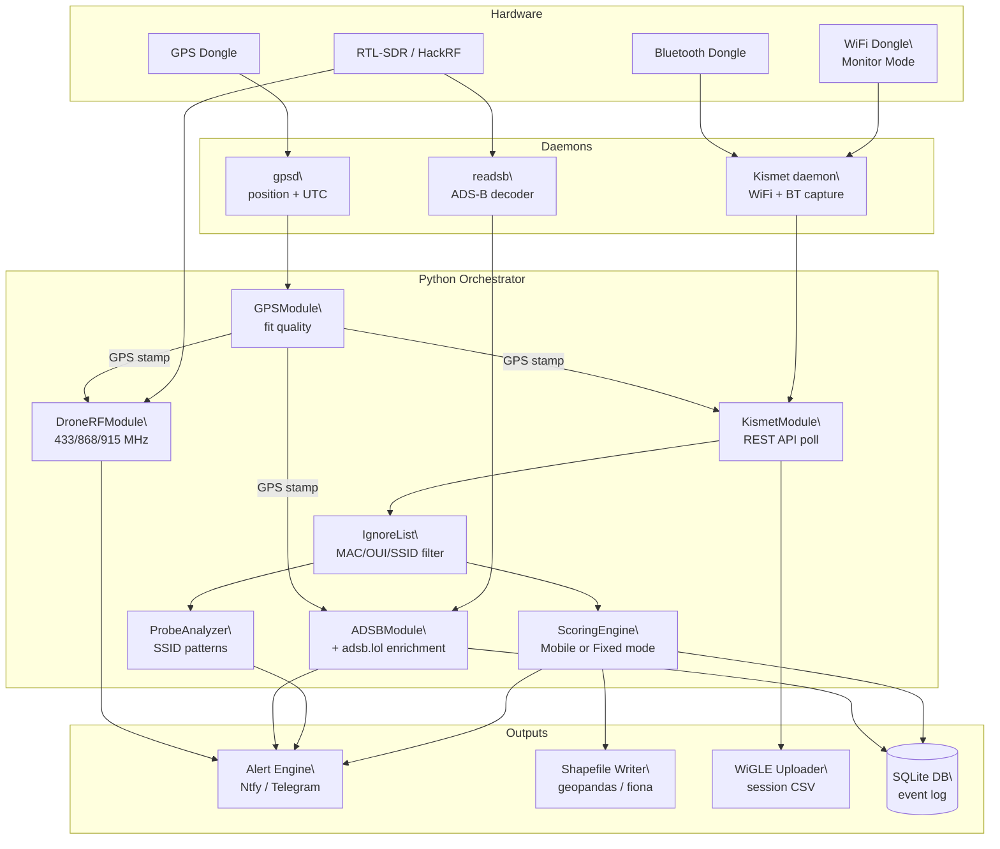

# Passive Vigilance

[](https://github.com/Isthistak3n/Passive-Vigilance/actions/workflows/ci.yml)
[](https://github.com/Isthistak3n/Passive-Vigilance/actions)
[](LICENSE)
[](https://github.com/Isthistak3n/Passive-Vigilance/releases)
[](https://www.raspberrypi.org/)

> A passive RF/WiFi/BT/ADS-B sensor platform for counter-surveillance,
> situational awareness, and open-source RF intelligence.

---

## What is this?

Passive Vigilance is a field-deployable sensor platform built on a Raspberry Pi
that helps you understand the RF environment around you — without ever
transmitting a single packet. It listens. It logs. It alerts.

Originally inspired by [Chasing Your Tail NG](https://github.com/ArgeliusLabs/Chasing-Your-Tail-NG),
Passive Vigilance extends the counter-surveillance concept into a unified,
always-on sensor platform covering WiFi, Bluetooth, ADS-B aircraft, and
drone command links simultaneously — all GPS-stamped and GIS-ready.

If you've ever wanted to know whether you're being followed, whether there's
a drone overhead, or who's flying above your location and where they came
from — this is built for that.

**It is entirely passive. It never connects to, transmits to, or interferes
with any device or network.**

---

## Use cases

- **Counter-surveillance (mobile)** — detect devices that follow you across
  multiple locations using WiFi and Bluetooth beacon persistence scoring
- **Counter-surveillance (fixed / leave-behind)** — deploy as a stationary
  sensor that learns the location's normal RF "pattern of life," then flags
  devices that deviate from it — new devices that appear and linger (see
  [Detection modes](#detection-modes))
- **Drone detection** — alert when drone command link frequencies
  (433 MHz, 868 MHz, 915 MHz, 2.4 GHz) are active in your area
- **Aircraft awareness** — track aircraft overhead with full registration,
  operator, and origin data via ADS-B and adsb.lol enrichment
- **Wardriving** — automatically upload session data to WiGLE.net to
  contribute to the global RF database
- **GIS analysis** — all detections are GPS-stamped and exported as
  shapefiles, GeoJSON, and KML for post-session analysis in QGIS, ArcGIS,
  Google Earth, or Google Maps
- **Field security** — deploy as a standalone sensor at events, locations,
  or during travel for passive RF situational awareness

---

## How it works

Every detection from every sensor is tagged with a GPS fix (lat, lon, UTC)
before being written to disk or triggering an alert. The platform runs
entirely as background systemd services — plug in power and it starts
capturing automatically.



---

## Detection modes

Counter-surveillance means different things depending on whether the sensor is
**moving** or **stationary**, so the scoring strategy forks on a required
`NODE_MODE` setting. There is **no default** — the node refuses to start scoring
under an assumed mode (set `NODE_MODE` in `.env`, or pass `--mode fixed|mobile`).

| Mode | Question it answers | The signal |
|------|---------------------|------------|
| `mobile` | *"Does this device follow me across locations?"* | A device seen at many of the places you go (location diversity). The original wardriving / on-person model — unchanged. |
| `fixed` | *"What deviates from this location's normal?"* | A device that was **not** part of the learned baseline and now appears and lingers (novelty). The base-station / leave-behind model. |

A fixed node run under mobile scoring never alerts — a stationary sensor only
ever produces one location cluster, so every device forfeits the location signal.
That is exactly why mode is an explicit, fail-loud deployment choice.

**Fixed mode — pattern of life:**

- On first start the node enters a **baseline learning window**
  (`FIXED_BASELINE_HOURS`, default 72h), characterising the environment's normal
  RF devices before it begins flagging.
- After the window freezes, deviations from the baseline are flagged with
  **graduated severity** (suspicious → likely → high): **novelty** (a device
  never seen during baseline that appears and lingers) and **off-schedule** (a
  known baseline device seen in an hour-of-day it was never seen in during
  baseline). Off-schedule only activates once a device's baseline spans enough
  distinct hours to define a schedule (`OFF_SCHEDULE_MIN_BASELINE_HOURS`,
  default 12), which avoids false alarms from thin baselines.
- Devices are keyed by MAC (stable) or by a **content fingerprint** that survives
  MAC rotation (randomized devices), so one logical device's rotating addresses map
  to a single profile: WiFi clients by their probed SSIDs + information-element hash
  (`wifi-fp:`), BLE advertisers by their vendor / service / name advertisement
  (`ble-fp:`). A device with no distinctive content (bare vendor id, no named SSID)
  stays per-address so distinct devices are never merged. BLE advertisements are
  captured passively over raw HCI (`BLE_SCANNER_ENABLED`), which also recovers a
  real RSSI; randomized BLE devices were previously untrackable.
- The baseline persists to **SQLite** and survives restarts and reboots — a
  crash loop resumes the existing learning window instead of resetting it, so the
  node still eventually alerts. The learning start time is durable and never
  recomputed on boot. Per-device RSSI statistics are also banked during learning
  for future approaching-signal work.

**Entity / observation foundation:** independently of scoring, every poll is
recorded into a durable SQLite store (what each device probes for, a per-device
fingerprint, one entity per device, and a growing observation history). This runs
at the capture layer for **both** node modes and is the substrate for
cross-session device identity. It uses real upserts, so a stable device set
produces a fixed number of rows rather than growing per poll.

**Switching modes from the dashboard:** when the optional web GUI is enabled with
a `GUI_TOKEN` set, the dashboard header has a small **Mode** control to write
`NODE_MODE` to `.env`. Mode is read once at startup, so the control makes the
**restart requirement explicit** — the running node keeps its current mode until
it is restarted.

> Roadmap: still ahead are the approaching-signal (rising-RSSI) trigger,
> abnormal-dwell detection, egregious-during-baseline alerting, slow baseline
> adaptation, and WiGLE resident-vs-visitor enrichment. See
> [docs/design-detection-modes.md](docs/design-detection-modes.md) for the full
> phased plan and what has shipped so far.

---

## Project status

| Module | Status | Description |
|--------|--------|-------------|
| GPS daemon | ✅ Complete | gpsd integration, fix quality, HDOP filter — 12 tests |
| Kismet integration | ✅ Complete | REST API, API key auth, WiGLE CSV — 10 tests |
| ADS-B | ✅ Complete | readsb + adsb.lol enrichment — 20 tests |
| Drone RF | ✅ Complete | pyrtlsdr, duty cycle, thermal throttle — 15 tests (includes drain_detections) |
| WiFi monitor mode | ✅ Complete | RTL8811CU udev + NM unmanaged — 15 tests |
| Ignore lists | ✅ Complete | MAC/OUI/SSID filtering, CLI tool — 25 tests |
| MAC randomization | ✅ Complete | Randomization detection, fingerprinting, ignore — 14 tests |
| Persistence engine | ✅ Complete | Time-window scoring, ProbeAnalyzer, DetectionEvent — 27 tests |
| Detection modes | ✅ Phase 2 | `NODE_MODE` selector, ScoringEngine fork, FixedScoring (novelty + off-schedule + graduated severity), durable crash-safe SQLite baseline; randomized devices keyed by content fingerprint (`wifi-fp:`/`ble-fp:`) so identity survives MAC rotation |
| BLE advertisement capture | ✅ Complete | Passive raw-HCI listener (`BLE_SCANNER_ENABLED`); recovers vendor data, service UUIDs, and real RSSI; auto-detects the HCI controller — 18 tests |
| Device fingerprinting | ✅ Complete | Randomization-resistant BLE + WiFi signatures (vendor/services/name; probed SSIDs + IE hash) with over-merge safeguards — 27 tests |
| Entity/observation store | ✅ Complete | Durable SQLite (probe evidence, fingerprint, entities, observation history); recorded at the poll site for both modes; thread-safe reads for the GUI |
| Alert engine | ✅ Complete | NtfyBackend, TelegramBackend, DiscordBackend, RateLimiter — 24 tests |
| Shapefile writer | ✅ Complete | geopandas/fiona, 3 layers per session — 7 tests |
| KML output | ✅ Complete | Google Earth color-coded placemarks, track lines — 14 tests |
| WiGLE uploader | ✅ Complete | multipart POST, session CSV upload — 7 tests |
| Web GUI | ✅ Complete | Optional Flask dashboard, live Leaflet map, SSE stream, mode toggle — 34 tests |
| Orchestrator | ✅ Complete | asyncio event loop, crash flush, isolated shutdown — 28 tests |

**537 tests passing** across all modules.

---

## Hardware

| Component | Recommended | Notes |
|-----------|-------------|-------|
| Raspberry Pi | Pi 4B (4 GB RAM) | Pi 3B+ works for dev/test |
| SDR receiver | RTL-SDR Blog V3 or HackRF | ADS-B + drone RF scanning |
| WiFi dongle | Panda PAU0B, Alfa AWUS036ACH | Any monitor-mode capable adapter |
| Bluetooth dongle | Any CSR-based USB dongle | Or use Pi built-in Bluetooth |
| GPS dongle | u-blox 7 or 8 (e.g. VK-172) | NMEA over USB to `/dev/ttyUSB0` |

> **Tested on:** Raspberry Pi 3B+ and 4B, Debian 13 Trixie (ARM64)

---

## Quick start

The fastest path to a running sensor is the one-command installer:

```bash
git clone git@github.com:Isthistak3n/Passive-Vigilance.git
cd Passive-Vigilance
sudo bash deploy/install.sh
```

`install.sh` handles everything: system packages, Python dependencies,
gpsd configuration, Kismet installation (auto-detects Debian version),
WiFi monitor mode setup, systemd service installation, and `.env` creation.

After install, follow the on-screen prompts to:

1. Generate a Kismet API key at `http://[pi-ip]:2501`
   - Settings → API Keys → Create → name: `passive-vigilance`
2. Add your credentials to `.env`:
```bash
   nano .env
```
   Set `NODE_MODE` to `fixed` or `mobile` — this is **required** and has no
   default; the node refuses to start scoring without it (see
   [Detection modes](#detection-modes)).
   To enable the optional web dashboard, set `GUI_ENABLED=true` in `.env`
   then open `http://[pi-ip]:8080` in any browser. Set `GUI_TOKEN` as well if
   you want to use the in-dashboard mode toggle.
3. Add your own devices to the ignore list to reduce noise:
```bash
   python3 scripts/manage_ignore_list.py --import-kismet
```
4. Enable and start the sensor:
```bash
   sudo systemctl enable passive-vigilance
   sudo systemctl start passive-vigilance
```

See [docs/setup.md](docs/setup.md) for full installation and
configuration details including troubleshooting.

---

## Architecture

```
Passive-Vigilance/
├── main.py                           # asyncio orchestrator; loads .env; SIGINT/SIGTERM shutdown
├── requirements.txt                  # Python dependencies
├── .env.example                      # Environment variable template (never commit .env)
├── core/
│   ├── exceptions.py                 # Custom exception hierarchy + ErrorSeverity enum
│   └── logging.py                    # Structured logger factory — consistent log format across modules
├── modules/
│   ├── gps.py                        # GPSModule — gpsd streaming client; position/time backbone
│   ├── kismet.py                     # KismetModule — Kismet REST API; async WiFi + BT polling; probe-SSID + fingerprint extraction
│   ├── dump1090.py                   # ADSBModule — readsb JSON; aircraft polling + adsb.lol enrichment
│   ├── drone_rf.py                   # DroneRFModule — pyrtlsdr; passive RF scan for drone signatures + drain_detections()
│   ├── remote_id.py                  # RemoteIDModule — FAA Remote ID (ASTM F3411-22a) via Kismet 802.11 vendor IE
│   ├── sdr_manager.py                # SDRManager — RTL-SDR inventory detection; SDRMode resolution
│   ├── sdr_coordinator.py            # SDRCoordinator — asyncio time-share scheduler for single-dongle setups
│   ├── sdr_utils.py                  # Shared RTL-SDR hardware detection utilities
│   ├── orchestrator.py               # SensorOrchestrator — module lifecycle and health management
│   ├── ignore_list.py                # IgnoreList — MAC/OUI/SSID filter; atomic JSON persistence
│   ├── mac_utils.py                  # MAC randomization detection, type classification, fingerprinting
│   ├── alerts.py                     # AlertBackend ABC + Ntfy / Telegram / Discord / Console backends
│   ├── kml_writer.py                 # KMLWriter — Google Earth KML with color-coded placemarks and track lines
│   ├── persistence.py                # PersistenceEngine — mobile (location-diversity) scoring; DetectionEvent dataclass
│   ├── scoring_engine.py             # ScoringEngine ABC — strategy interface (update + status) selected by NODE_MODE
│   ├── fixed_scoring.py              # FixedScoring — fixed-node baseline-deviation (novelty + off-schedule) scoring
│   ├── baseline_store.py             # BaselineStore — durable SQLite baseline; crash-safe learning window; hour-mask + RSSI stats
│   ├── entity_store.py               # EntityStore — durable SQLite (probe evidence, fingerprint, entities, observation history)
│   ├── probe_analyzer.py             # ProbeAnalyzer — WiFi probe pattern analysis
│   ├── shapefile.py                  # ShapefileWriter — geopandas/fiona; detections as .shp point features
│   ├── wigle.py                      # WiGLEUploader — upload Kismet CSV to WiGLE.net at session end
├── gui/
│   ├── __init__.py                   # Empty package marker
│   ├── server.py                     # GUIServer — Flask in daemon thread; SSE /stream; REST /api/*; mode toggle (/api/mode)
│   ├── templates/
│   │   └── index.html                # Dark-theme SPA; 5 tabs; Leaflet map; SSE client
│   └── static/
│       ├── app.js                    # SSE client; Leaflet markers; table rendering; tab switching
│       └── style.css                 # Dark theme; KML-matched alert colors; touch-friendly
├── tests/
│   ├── test_gps.py                   # 12 tests — GPSModule + quality filter
│   ├── test_kismet.py                # 10 tests — KismetModule
│   ├── test_dump1090.py              # 20 tests — ADSBModule
│   ├── test_drone_rf.py              # 15 tests — DroneRFModule + drain_detections()
│   ├── test_monitor_mode.py          # 15 tests — WiFi monitor mode
│   ├── test_ignore_list.py           # 25 tests — IgnoreList
│   ├── test_mac_utils.py             # 14 tests — MAC randomization + fingerprinting
│   ├── test_persistence.py           # 27 tests — PersistenceEngine
│   ├── test_probe_analyzer.py        # ProbeAnalyzer (persistence suite)
│   ├── test_node_mode.py             # NODE_MODE resolution + fail-loud
│   ├── test_scoring_engine.py        # ScoringEngine interface conformance
│   ├── test_fixed_scoring.py         # FixedScoring — novelty, off-schedule, graduated severity, activation guard
│   ├── test_baseline_store.py        # durable SQLite baseline + crash-loop regression + hour-mask/signal stats
│   ├── test_entity_store.py          # EntityStore upserts (flat-line) + poll-site recording in both modes
│   ├── test_kml_writer.py            # 14 tests — KMLWriter
│   ├── test_shapefile.py             # 7 tests — ShapefileWriter
│   ├── test_wigle.py                 # 7 tests — WiGLEUploader
│   ├── test_sdr_manager.py           # SDRManager + SDRCoordinator tests
│   ├── test_sdr_handoff.py           # SDRCoordinator handoff tests
│   ├── test_remote_id.py             # RemoteIDModule tests
│   ├── test_orchestrator.py          # 28 tests — PassiveVigilance orchestrator
│   ├── test_gui.py                   # 34 tests — GUIServer + mode toggle
│   └── test_alerts.py                # 24 tests — AlertEngine
├── scripts/
│   └── manage_ignore_list.py         # CLI: add/remove MAC, OUI, SSID; --import-kismet bulk add
├── deploy/
│   ├── install.sh                    # One-command installer; auto-detects Debian/Raspberry Pi OS
│   ├── kismet.service                # Kismet systemd unit
│   ├── passive-vigilance.service     # Orchestrator systemd unit
│   ├── gpsd.override.conf            # gpsd drop-in config to add -n flag
│   ├── 99-wlan1-monitor.rules        # udev rule — set wlan1 to monitor mode at boot/plug-in
│   └── 99-unmanaged-wlan1.conf       # NetworkManager: mark wlan1 as unmanaged
├── docs/
│   └── setup.md                      # Full installation, configuration, and troubleshooting guide
└── data/
    └── ignore_lists/                 # MAC/OUI/SSID ignore list JSON files (git-ignored)
```

---

## Configuration

Copy `.env.example` to `.env` and fill in your credentials:

```bash
cp .env.example .env
nano .env
```

Key variables:

| Variable | Description | Default |
|----------|-------------|---------|
| `NODE_MODE` | **Required** scoring mode: `fixed` or `mobile` (no default — node refuses to start without it) | — |
| `FIXED_BASELINE_HOURS` | Fixed mode: baseline learning window before novelty flagging begins | `72` |
| `BASELINE_DB_PATH` | Fixed mode: durable baseline SQLite path (blank = `data/baseline.db`) | — |
| `KISMET_API_KEY` | Generated in Kismet web UI at `:2501` | — |
| `WIGLE_API_NAME` | WiGLE.net account API name | — |
| `WIGLE_API_KEY` | WiGLE.net account API key | — |
| `ADSBXLOL_API_KEY` | adsb.lol API key (free by feeding) | — |
| `ALERT_BACKEND` | `ntfy`, `signal`, or `telegram` | `ntfy` |
| `GPS_DEVICE` | GPS dongle device path | `/dev/ttyUSB0` |
| `WIFI_MONITOR_INTERFACE` | WiFi dongle interface name | `wlan1` |
| `KISMET_HOST` | Kismet daemon host | `localhost` |
| `KISMET_PORT` | Kismet REST API port | `2501` |
| `DUMP1090_HOST` | readsb/dump1090 host | `localhost` |
| `LOG_LEVEL` | Python logging level | `INFO` |
| `GPS_MIN_QUALITY` | GPS fix quality gate: `any`, `2d`, or `3d` | `2d` |
| `GPS_MAX_HDOP` | Reject fixes with HDOP above this value | `5.0` |
| `DRONE_RF_REST_SECONDS` | Seconds to rest between DroneRF sweep cycles | `20` |
| `DRONE_RF_MAX_TEMP_C` | CPU temp threshold that doubles rest period | `75` |
| `GUI_ENABLED` | Enable live web dashboard | `false` |
| `GUI_PORT` | Web dashboard port | `8080` |
| `GUI_TOKEN` | Bearer/`?token=` for the dashboard; **required** to use the mode toggle | — |

---

## Boot sequence

All services start automatically on boot in dependency order:

Check service status at any time:

```bash
sudo systemctl status gpsd
sudo systemctl status kismet
sudo systemctl status passive-vigilance

# View live logs
journalctl -fu passive-vigilance
```

---

## Contributing

Contributions welcome. See [CONTRIBUTING.md](CONTRIBUTING.md) for the
full branch strategy and guidelines.

**Branch model:** `feat|fix|docs|hotfix|refactor/*` → `main`

- All work branches use one of five prefixes: `feat/`, `fix/`, `docs/`, `hotfix/`, `refactor/`
- Cut all branches from `main`; PRs merge directly to `main`
- Gate: CI green + Pi validation recorded in the PR + Cody approval
- No direct commits to `main` (ruleset-enforced)

To get started:

```bash
git clone git@github.com:Isthistak3n/Passive-Vigilance.git
cd Passive-Vigilance
git checkout main
git checkout -b feat/your-feature-name
```

---

## Legal / Responsible use notice

This tool is intended **for lawful passive monitoring and research only.**

You are responsible for ensuring your use complies with all applicable
local, national, and international laws — including but not limited to
radio spectrum regulations and privacy legislation in your jurisdiction.

**This tool never transmits.** It passively receives publicly broadcast
RF signals only. It does not connect to, associate with, or interfere
with any wireless device or network.

The authors accept no liability for unlawful or unethical use.

---

## License

MIT — see [LICENSE](LICENSE)

---

## Acknowledgements

Passive Vigilance was directly inspired by
[Chasing Your Tail NG](https://github.com/ArgeliusLabs/Chasing-Your-Tail-NG)
by [@matt0177](https://github.com/matt0177) — the original Python
counter-surveillance WiFi probe analyzer that proved the concept and
showed what was possible with Kismet and a Raspberry Pi.

CYT-NG's approach to persistence detection, WiGLE integration, and
GPS-correlated surveillance analysis laid the groundwork for this project.
If counter-surveillance WiFi monitoring is your primary use case,
check it out — it does that one thing exceptionally well.
