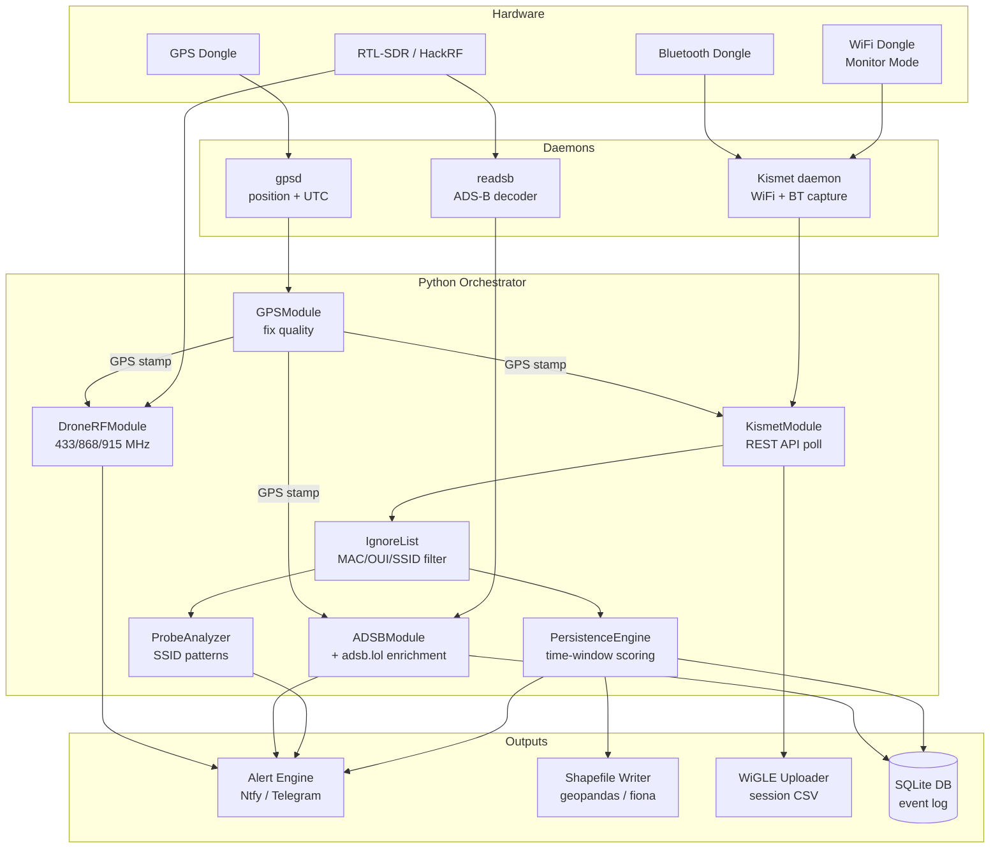

# Passive Vigilance

[](https://github.com/Isthistak3n/Passive-Vigilance/actions/workflows/ci.yml)
[](https://github.com/Isthistak3n/Passive-Vigilance/actions)
[](LICENSE)
[](https://github.com/Isthistak3n/Passive-Vigilance/releases)
[](https://www.raspberrypi.org/)

> A passive RF/WiFi/BT/ADS-B sensor platform for counter-surveillance,
> situational awareness, and open-source RF intelligence.

---

## What is this?

Passive Vigilance is a field-deployable sensor platform built on a Raspberry Pi
that helps you understand the RF environment around you — without ever
transmitting a single packet. It listens. It logs. It alerts.

Originally inspired by [Chasing Your Tail NG](https://github.com/ArgeliusLabs/Chasing-Your-Tail-NG),
Passive Vigilance extends the counter-surveillance concept into a unified,
always-on sensor platform covering WiFi, Bluetooth, ADS-B aircraft, and
drone command links simultaneously — all GPS-stamped and GIS-ready.

If you've ever wanted to know whether you're being followed, whether there's
a drone overhead, or who's flying above your location and where they came
from — this is built for that.

**It is entirely passive. It never connects to, transmits to, or interferes
with any device or network.**

---

## Use cases

- **Counter-surveillance** — detect devices that follow you across multiple
  locations using WiFi and Bluetooth beacon persistence scoring
- **Drone detection** — alert when drone command link frequencies
  (433 MHz, 868 MHz, 915 MHz, 2.4 GHz) are active in your area
- **Aircraft awareness** — track aircraft overhead with full registration,
  operator, and origin data via ADS-B and adsb.lol enrichment
- **Wardriving** — automatically upload session data to WiGLE.net to
  contribute to the global RF database
- **GIS analysis** — all detections are GPS-stamped and exported as
  shapefiles for post-session analysis in QGIS or ArcGIS
- **Field security** — deploy as a standalone sensor at events, locations,
  or during travel for passive RF situational awareness

---

## How it works

Every detection from every sensor is tagged with a GPS fix (lat, lon, UTC)
before being written to disk or triggering an alert. The platform runs
entirely as background systemd services — plug in power and it starts
capturing automatically.



---

## Project status

| Module | Status | Description |
|--------|--------|-------------|
| GPS daemon | ✅ Complete | gpsd integration, fix quality — 9 tests |
| Kismet integration | ✅ Complete | REST API, API key auth, WiGLE CSV — 10 tests |
| ADS-B + drone RF | ✅ Complete | readsb + adsb.lol enrichment — 20 tests |
| WiFi monitor mode | ✅ Complete | MT7610U/RTL8811AU udev + NM unmanaged — 15 tests |
| Ignore lists | ✅ Complete | MAC/OUI/SSID filtering, CLI tool — 22 tests |
| Persistence engine | ✅ Complete | Time-window scoring, ProbeAnalyzer, DetectionEvent — 24 tests |
| Alert engine | ✅ Complete | NtfyBackend, TelegramBackend, DiscordBackend, RateLimiter — 24 tests |
| Shapefile writer | ✅ Complete | geopandas/fiona, 3 layers per session — 7 tests |
| WiGLE uploader | ✅ Complete | multipart POST, session CSV upload — 7 tests |
| Orchestrator | ✅ Complete | asyncio event loop, session management — 17 tests |

**143 tests passing** across all modules.

---

## Hardware

| Component | Recommended | Notes |
|-----------|-------------|-------|
| Raspberry Pi | Pi 4B (4 GB RAM) | Pi 3B+ works for dev/test |
| SDR receiver | RTL-SDR Blog V3 or HackRF | ADS-B + drone RF scanning |
| WiFi dongle | Panda PAU0B, Alfa AWUS036ACH | Any monitor-mode capable adapter |
| Bluetooth dongle | Any CSR-based USB dongle | Or use Pi built-in Bluetooth |
| GPS dongle | u-blox 7 or 8 (e.g. VK-172) | NMEA over USB to `/dev/ttyUSB0` |

> **Tested on:** Raspberry Pi 3B+ and 4B, Debian 13 Trixie (ARM64)

---

## Quick start

The fastest path to a running sensor is the one-command installer:

```bash
git clone git@github.com:Isthistak3n/Passive-Vigilance.git
cd Passive-Vigilance
sudo bash deploy/install.sh
```

`install.sh` handles everything: system packages, Python dependencies,
gpsd configuration, Kismet installation (auto-detects Debian version),
WiFi monitor mode setup, systemd service installation, and `.env` creation.

After install, follow the on-screen prompts to:

1. Generate a Kismet API key at `http://[pi-ip]:2501`
   - Settings → API Keys → Create → name: `passive-vigilance`
2. Add your credentials to `.env`:
```bash
   nano .env
```
3. Add your own devices to the ignore list to reduce noise:
```bash
   python3 scripts/manage_ignore_list.py --import-kismet
```
4. Enable and start the sensor:
```bash
   sudo systemctl enable passive-vigilance
   sudo systemctl start passive-vigilance
```

See [docs/setup.md](docs/setup.md) for full installation and
configuration details including troubleshooting.

---

## Architecture

```
Passive-Vigilance/
├── main.py                           # asyncio orchestrator; loads .env; SIGINT/SIGTERM shutdown
├── requirements.txt                  # Python dependencies
├── .env.example                      # Environment variable template (never commit .env)
├── modules/
│   ├── gps.py                        # GPSModule — gpsd streaming client; position/time backbone
│   ├── kismet.py                     # KismetModule — Kismet REST API; async WiFi + BT polling
│   ├── dump1090.py                   # ADSBModule — readsb JSON; aircraft polling + adsb.lol enrichment
│   ├── drone_rf.py                   # DroneRFModule — pyrtlsdr; passive RF scan for drone signatures
│   ├── ignore_list.py                # IgnoreList — MAC/OUI/SSID filter; atomic JSON persistence
│   ├── alerts.py                     # AlertBackend ABC + Ntfy / Telegram / Discord / Console backends
│   ├── persistence.py                # PersistenceEngine — time-window scoring; DetectionEvent dataclass
│   ├── probe_analyzer.py             # ProbeAnalyzer — WiFi probe pattern analysis
│   ├── shapefile.py                  # ShapefileWriter — geopandas/fiona; detections as .shp point features
│   └── wigle.py                      # WiGLEUploader — upload Kismet CSV to WiGLE.net at session end
├── tests/
│   ├── test_gps.py                   # 9 tests — GPSModule
│   ├── test_kismet.py                # 10 tests — KismetModule
│   ├── test_dump1090.py              # 20 tests — ADSBModule
│   ├── test_monitor_mode.py          # 15 tests — WiFi monitor mode
│   ├── test_ignore_list.py           # 22 tests — IgnoreList
│   ├── test_persistence.py           # 24 tests — PersistenceEngine
│   ├── test_probe_analyzer.py        # ProbeAnalyzer (persistence suite)
│   └── test_alerts.py                # 22 tests — AlertEngine
├── scripts/
│   └── manage_ignore_list.py         # CLI: add/remove MAC, OUI, SSID; --import-kismet bulk add
├── deploy/
│   ├── install.sh                    # One-command installer; auto-detects Debian/Raspberry Pi OS
│   ├── kismet.service                # Kismet systemd unit
│   ├── passive-vigilance.service     # Orchestrator systemd unit
│   ├── gpsd.override.conf            # gpsd drop-in config to add -n flag
│   ├── 99-wlan1-monitor.rules        # udev rule — set wlan1 to monitor mode at boot/plug-in
│   └── 99-unmanaged-wlan1.conf       # NetworkManager: mark wlan1 as unmanaged
├── docs/
│   └── setup.md                      # Full installation, configuration, and troubleshooting guide
└── data/
    └── ignore_lists/                 # MAC/OUI/SSID ignore list JSON files (git-ignored)
```

---

## Configuration

Copy `.env.example` to `.env` and fill in your credentials:

```bash
cp .env.example .env
nano .env
```

Key variables:

| Variable | Description | Default |
|----------|-------------|---------|
| `KISMET_API_KEY` | Generated in Kismet web UI at `:2501` | — |
| `WIGLE_API_NAME` | WiGLE.net account API name | — |
| `WIGLE_API_KEY` | WiGLE.net account API key | — |
| `ADSBXLOL_API_KEY` | adsb.lol API key (free by feeding) | — |
| `ALERT_BACKEND` | `ntfy`, `signal`, or `telegram` | `ntfy` |
| `GPS_DEVICE` | GPS dongle device path | `/dev/ttyUSB0` |
| `WIFI_MONITOR_INTERFACE` | WiFi dongle interface name | `wlan1` |
| `KISMET_HOST` | Kismet daemon host | `localhost` |
| `KISMET_PORT` | Kismet REST API port | `2501` |
| `DUMP1090_HOST` | readsb/dump1090 host | `localhost` |
| `LOG_LEVEL` | Python logging level | `INFO` |

---

## Boot sequence

All services start automatically on boot in dependency order:

Check service status at any time:

```bash
sudo systemctl status gpsd
sudo systemctl status kismet
sudo systemctl status passive-vigilance

# View live logs
journalctl -fu passive-vigilance
```

---

## Contributing

Contributions welcome. See [CONTRIBUTING.md](CONTRIBUTING.md) for the
full branch strategy and guidelines.

**Branch model:** `feature/*` → `dev` → `main`

- All feature work happens on `feature/*` branches cut from `dev`
- PRs required to merge into `dev`
- `main` only receives merges from `dev` at stable milestones
- No direct commits to `main`

To get started:

```bash
git clone git@github.com:Isthistak3n/Passive-Vigilance.git
cd Passive-Vigilance
git checkout dev
git checkout -b feature/your-feature-name
```

---

## Legal / Responsible use notice

This tool is intended **for lawful passive monitoring and research only.**

You are responsible for ensuring your use complies with all applicable
local, national, and international laws — including but not limited to
radio spectrum regulations and privacy legislation in your jurisdiction.

**This tool never transmits.** It passively receives publicly broadcast
RF signals only. It does not connect to, associate with, or interfere
with any wireless device or network.

The authors accept no liability for unlawful or unethical use.

---

## License

MIT — see [LICENSE](LICENSE)

---

## Acknowledgements

Passive Vigilance was directly inspired by
[Chasing Your Tail NG](https://github.com/ArgeliusLabs/Chasing-Your-Tail-NG)
by [@matt0177](https://github.com/matt0177) — the original Python
counter-surveillance WiFi probe analyzer that proved the concept and
showed what was possible with Kismet and a Raspberry Pi.

CYT-NG's approach to persistence detection, WiGLE integration, and
GPS-correlated surveillance analysis laid the groundwork for this project.
If counter-surveillance WiFi monitoring is your primary use case,
check it out — it does that one thing exceptionally well.
